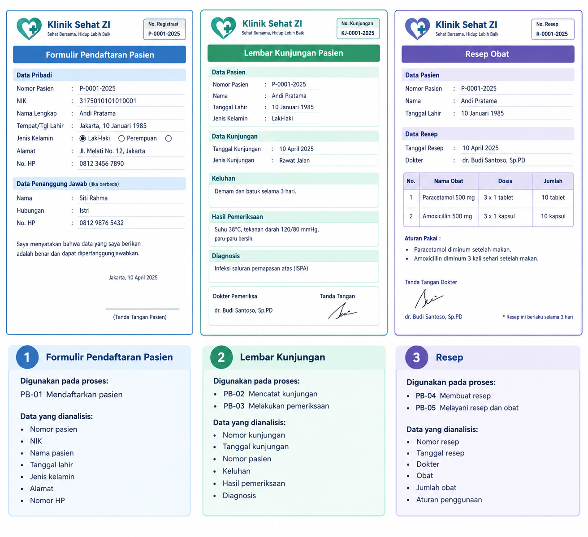

# Dokumen Kebutuhan Data - Klinik Sehat ZI

## 1. Latar belakang dan aktivitas organisasi

- Latar Belakang

Klinik adalah salah satu bentuk layanan kesehatan yang berfokus kepada pengobatan dan pemberian penanganan medis kepada pasien. Kegiatan operasional klinik melibatkan pengelolaan data pasien, pendaftaran kunjungan, pemeriksaan pasien, pencatatan rekam medis, resep obat, pembayaran, serta pengelolaan persediaan obat.

Pengelolaan data diperlukan agar informasi pasien, pelayanan kesehatan, transaksi, dan persediaan obat dapat dicatat dengan baik. Data yang dihasilkan dapat digunakan untuk kebutuhan informasi dan pembuatan laporan klinik.

- Aktivitas Organisasi

1. Pendaftaran dan pencatatan data pasien
2. Pencatatan kunjungan pasien
3. Pemeriksaan pasien oleh tenaga medis
4. Pencatatan hasil pemeriksaan dan rekam medis
5. Pembuatan dan pencatatan resep obat
6. Pelayanan obat melalui apotek
7. Pencatatan pembayaran pelayanan dan obat
8. Pengelolaan persediaan obat
9. Penerimaan obat dari pemasok
10. Penyusunan laporan operasional klinik

## 2. Aktor dan proses bisnis

|Kode|Proses Bisnis|Aktor|Pemicu|
|-|-|-|-|
|PB-01|Mendaftarkan pasien|Petugas Pendaftaran|Pasien baru datang ke klinik|
|PB-02|Mencatat kunjungan pasien|Petugas Pendaftaran|Pasien melakukan kunjungan|
|PB-03|Melakukan pemeriksaan pasien|Dokter|Pasien masuk ruang pemeriksaan|
|PB-04|Membuat resep obat|Dokter|Pasien membutuhkan obat|
|PB-05|Melayani resep dan obat|Apoteker/Petugas Apotek|Resep diterima oleh apotek|
|PB-06|Mencatat pembayaran|Kasir|Pasien menyelesaikan pembayaran|
|PB-07|Mengelola persediaan obat|Apoteker/Petugas Apotek|Stok obat perlu diperbarui|
|PB-08|Memesan dan menerima obat dari pemasok|Petugas Pengadaan|Stok obat mencapai batas minimum|

## 3. Dokumen sumber yang dianalisis

## 4. Entitas kandidat dan elemen data

|Entitas kandidat|Elemen data utama|Sumber|
|-|-|-|
|Pasien|nomor pasien, NIK, nama pasien, tanggal lahir, jenis kelamin, alamat, nomor HP|Formulir pendaftaran pasien|
|Kunjungan|nomor kunjungan, tanggal kunjungan, nomor pasien, jenis kunjungan, keluhan|Lembar kunjungan|
|Pemeriksaan|nomor pemeriksaan, nomor kunjungan, keluhan, hasil pemeriksaan, diagnosis|Lembar kunjungan|
|Resep|nomor resep, nomor kunjungan, tanggal resep, dokter, obat, jumlah obat, aturan pemakaian|Resep|
|Obat|kode obat, nama obat, satuan, harga obat, stok obat|Resep dan aktivitas apotek|
|Pemasok|kode pemasok, nama pemasok, alamat, nomor HP|Aktivitas pengadaan obat|
|Pembayaran|nomor pembayaran, nomor kunjungan, tanggal pembayaran, total bayar, metode pembayaran|Aktivitas pembayaran|

## 5. Aturan bisnis

|Kode|Aturan bisnis|
|-|-|
|AB-01|Setiap pasien yang terdaftar di Klinik Sehat ZI harus memiliki nomor pasien yang berbeda|
|AB-02|Setiap kunjungan pasien harus memiliki nomor kunjungan yang berbeda dan terhubung dengan satu pasien|
|AB-03|Setiap pemeriksaan harus terkait dengan kunjungan pasien yang tercatat|
|AB-04|Resep hanya dapat dibuat oleh dokter berdasarkan hasil pemeriksaan pasien|
|AB-05|Setiap resep harus memiliki minimal satu obat dan mencatat jumlah serta aturan pemakaian obat|
|AB-06|Stok obat tidak boleh menjadi negatif; apabila jumlah obat yang diminta melebihi stok tersedia, pelayanan obat harus ditolak atau ditunda|
|AB-07|Setiap transaksi pembayaran harus terkait dengan kunjungan pasien dan memiliki nomor pembayaran yang berbeda|
|AB-08|Data kesehatan pasien hanya dapat diakses oleh petugas yang memiliki kewenangan sesuai dengan perannya|

## 6. Kebutuhan informasi

|Kode|Kebutuhan informasi|Data yang diperlukan|
|-|-|-|
|KI-01|Jumlah pasien terdaftar dan jumlah kunjungan per hari dan per bulan|Pasien, Kunjungan|
|KI-02|Riwayat pemeriksaan pasien berdasarkan rentang waktu tertentu|Pasien, Kunjungan, Pemeriksaan|
|KI-03|Daftar resep dan obat yang diberikan kepada pasien|Pasien, Resep, Obat|
|KI-04|Daftar obat dengan stok di bawah batas minimum|Obat|
|KI-05|Jumlah dan total pembayaran pasien per hari dan per bulan|Kunjungan, Pembayaran|
|KI-06|Daftar pasien yang melakukan kunjungan dalam rentang waktu tertentu|Pasien, Kunjungan|

## 7. Matriks CRUD

|Proses|Pasien|Kunjungan|Pemeriksaan|Resep|Obat|Pemasok|Pembayaran|
|-|-|-|-|-|-|-|-|
|PB-01 Mendaftarkan pasien|C/U|||||||
|PB-02 Mencatat kunjungan|R|C||||||
|PB-03 Melakukan pemeriksaan|R|R|C/U|||||
|PB-04 Membuat resep|R|R|R|C|R|||
|PB-05 Melayani resep dan obat|R|R||R/U|R/U|||
|PB-06 Mencatat pembayaran|R|R||R|R||C|
|PB-07 Mengelola persediaan obat|||||R/U|||
|PB-08 Memesan dan menerima obat|||||C/U|C/R||

## 8. Kamus data awal

|Elemen|Arti|Contoh|Sumber|Aturan|Penanggung jawab|
|-|-|-|-|-|-|
|no_pasien|Nomor identitas pasien|P-001|Formulir pendaftaran|Setiap pasien memiliki nomor berbeda|Petugas pendaftaran|
|NIK|Nomor identitas kependudukan pasien|1871010101010001|Formulir pendaftaran|Sesuai identitas pasien|Petugas pendaftaran|
|nama_pasien|Nama lengkap pasien|Andi Pratama|Formulir pendaftaran|Tidak boleh kosong|Petugas pendaftaran|
|tanggal_lahir|Tanggal lahir pasien|10-01-2000|Formulir Pendaftaran|Harus berupa tanggal yang valid|Petugas pendaftaran|
|jenis_kelamin|Jenis kelamin pasien|Laki-laki|Formulir Pendaftaran|Mengikuti pilihan yang tersedia|Petugas pendaftaran|
|alamat|Alamat tempat tinggal pasien|Jl. Melati No. 12|Formulir pendaftaran|Dapat diperbarui jika berubah|Petugas pendaftaran|
|no_HP|Nomor telepon pasien|081234567890|Formulir pendaftaran|Format nomor harus valid|Petugas pendaftaran|
|no_kunjungan|Nomor identitas kunjungan|KJ-001|Lembar kunjungan|Setiap kunjungan memiliki nomor berbeda|Petugas pendaftaran|
|tanggal_kunjungan|Tanggal pasien melakukan kunjungan|03-10-2026|Lembar kunjungan|Harus berupa tanggal yang valid|Petugas pendaftaran|
|jenis_kunjungan|Jenis pelayanan yang dilakukan|Pemeriksaan umum|Lembar kunjungan|Mengikuti jenis layanan klinik|Petugas pendaftaran|
|keluhan|Keluhan yang disampaikan pasien|Demam dan batuk|Lembar kunjungan|Dicatat sesuai keterangan pasien|Dokter|
|no_pemeriksaan|Nomor identitas pemeriksaan|PM-001|Lembar kunjungan|Setiap pemeriksaan memiliki nomor berbeda|Dokter|
|hasil_pemeriksaan|Hasil pemeriksaan pasien|Suhu 38 Derajat Celsius|Lembar kunjungan|Dicatat berdasarkan hasil pemeriksaan|Dokter|
|diagnosis|Hasil diagnosis dokter|ISPA|Lembar kunjungan|Dicatat oleh dokter|Dokter|
|no_resep|Nomor identitas resep|R-001|Resep|Setiap resep memiliki nomor berbeda|Dokter|
|kode_obat|Kode identitas obat|OB-001|Resep|Setiap obat memiliki kode berbeda|Apoteker|
|nama_obat|Nama obat|Paracetamol|Resep|Tidak boleh kosong|Apoteker|
|stok_obat|Jumlah obat yang tersedia|50 tablet|Aktivitas apotek|Tidak boleh kurang dari 0|Apoteker|
|no_pembayaran|Nomor identitas pembayaran|BYR-001|Aktivitas pembayaran|Setiap pembayaran memiliki nomor berbeda|Kasir|
|total_bayar|Jumlah uang yang harus dibayar|Rp75.000|Aktivitas pembayaran|Nilai tidak boleh negatif|Kasir|

## 9. Kebutuhan non-fungsional data

Kebutuhan non-fungsional dicatat singkat: perkiraan sekitar 85 transaksi per hari, berdasarkan perhitungan P = (35 mod 9) + 1= 9 dan estimasi transaksi harian = 40 + (5 x P) = 85. Data transaksi dan riwayat pelayanan disimpan minimal lima tahun. Data pribadi dan data kesehatan pasien hanya dapat diakses oleh petugas yang memiliki kewenangan sesuai perannya. Data kesehatan dan hasil pemeriksaan hanya dapat diakses oleh dokter dan pimpinan klinik, sedangkan data resep dapat diakses oleh dokter dan apoteker untuk kebutuhan pelayanan.

## 10. Isu kualitas data yang diantisipasi

Isu kualitas data yang diperkirakan terjadi meliputi data pasien yang tidak lengkap, kesalahan format pada NIK atau nomor HP, data pasien yang tercatat lebih dari satu kali, serta kesalahan penulisan identitas pasien pada formulir dan lembar kunjungan. Selain itu, kesalahan dalam pencatatan penerimaan dan pengeluaran stok obat yang tidak sesuai dengan kondisi sebenarnya bisa terjadi jika stok obat tidak segera diperbarui. Data kesehatan dan diagnosis pasien juga perlu dijaga privasinya agar hanya dapat diakses oleh pihak yang memiliki kewenangan.

