# Laporan Praktikum Basis Data - Pertemuan 2

**Nama:** Nazia Karinnafila **NIM:** 25430035 **Kelas:** B **Tanggal:** 07-10-2026

## 1. Tujuan Praktikum

Mahasiswa mampu mengidentifikasi narasi yang memperlihatkan aktivitas dalam sebuah organisasi, aktor, serta proses bisnis dengan adanya dokumen sumber atau dengan melakukan wawancara; Mahasiswa juga dapat menganalisis serta mencatat elemen data, entitas, dan aturan dalam dokumen sumber; Mengetahui cara dalam membuat Matriks CRUD dan kamus data awal; Menulis kebutuhan non-fungsional serta isu kualitas data yang diantisipasi dalam tema yang telah dipilih.

## 2. Ringkasan Dasar Teori

* Analisis Kebutuhan

Analisis kebutuhan merupakan tahap awal yang memiliki peran penting dalam menentukan arah dan keberhasilan suatu proyek penelitian. Tahapan ini menjadi fondasi bagi seluruh proses berikutnya, seperti desain, pengembangan, implementasi, hingga evaluasi produk. Tanpa analisis kebutuhan yang tepat, produk yang dihasilkan berisiko tidak relevan dengan konteks pengguna atau gagal mencapai tujuan yang diharapkan. Analisis kebutuhan pada dasarnya bertujuan untuk mengidentifikasi masalah yang ada di lapangan, mengungkap kesenjangan antara kondisi ideal dan kenyataan, serta menentukan solusi yang paling tepat untuk menjawab permasalahan tersebut. Proses ini melibatkan pengumpulan informasi melalui berbagai teknik, seperti wawancara, observasi, angket, dan telaah dokumen.

* Data sebagai Aset Organisasi

Dalam era informasi yang serba cepat dan digital ini, pengelolaan data menjadi kunci penting bagi keberhasilan sebuah organisasi. Tujuan pengelolaan data tidak hanya terfokus pada penyimpanan dan proteksi, tetapi juga pada bagaimana memaksimalkan nilai data tersebut untuk kepentingan organisasi, termasuk pelanggan, karyawan, dan mitra bisnis. Secara sederhana, data adalah sekumpulan fakta, angka, karakter, atau simbol yang dikumpulkan melalui proses pengamatan, penelitian, maupun aktivitas sehari-hari. Data bisa berbentuk angka (numerik), teks, gambar, audio, atau video. Dalam konteks digital, data umumnya disimpan dan dikelola di dalam sistem komputer atau basis data (database).

* Matris CRUD dan Kamus Data

Matriks CRUD adalah alat yang kami gunakan pengembangan perangkat lunak untuk mengatur berbagai operasi yang dapat dilakukan aplikasi pada data di a basis data atau sistem. Ini adalah akronim untuk empat operasi dasar yang dapat dilakukan aplikasi pada data: Buat, Baca, Perbarui, dan Hapus. Matriks terdiri dari tabel di mana berbagai entitas data ditempatkan di sepanjang satu sumbu dan operasi CRUD ditempatkan di sepanjang sumbu lainnya. Setiap persimpangan dalam matriks menunjukkan apakah operasi tertentu dapat dilakukan pada entitas data tertentu.

Kamus data adalah kumpulan informasi yang mendefinisikan elemen-elemen data dalam sistem informasi, mencakup nama, deskripsi, format, dan hubungan antar data. Fungsi utama dari kamus data adalah untuk memastikan konsistensi dan pemahaman yang seragam tentang data di seluruh komponen sistem. Kamus data adalah komponen vital dalam perancangan sistem informasi yang efektif dan efisien. Dengan menyediakan dokumentasi terstruktur tentang elemen-elemen data, kamus data membantu memastikan bahwa semua pihak yang terlibat dalam pengembangan sistem memiliki pemahaman yang konsisten, sehingga mengurangi risiko kesalahan dan meningkatkan kualitas sistem yang dihasilkan.

* Pernyataan Kebutuhan

Pernyataan adalah ungkapan lisan atau tertulis yang digunakan untuk menyampaikan informasi, pendapat, atau, keyakinan. Pernyataan yang paling tepat merupakan pernyataan yang akurat dan sesuai dengan fakta atau situasi yang ada. Dalam situasi tertentu, pernyataan yang tepat dapat menjadi kunci dalam mengambil keputusan atau menyampaikan pendapat yang bisa memengaruhi orang lain.

## 3. Hasil Langkah Percobaan 

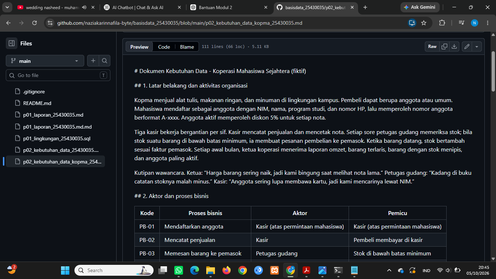

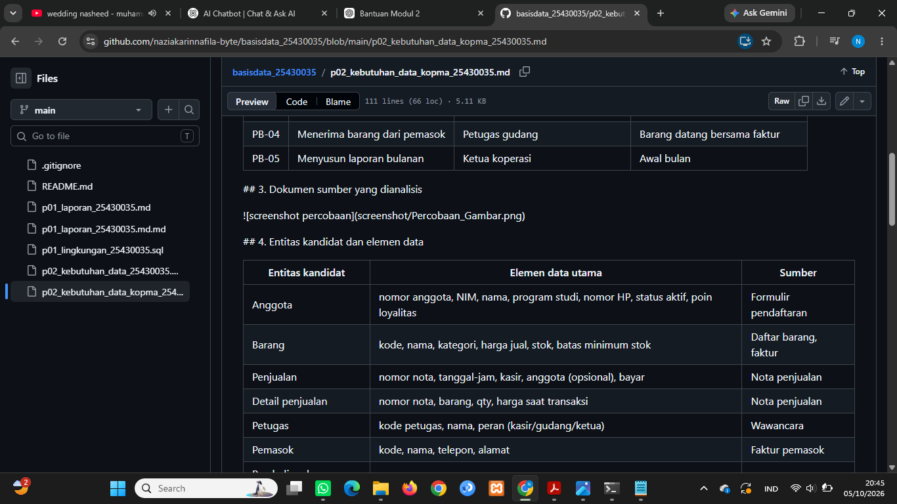

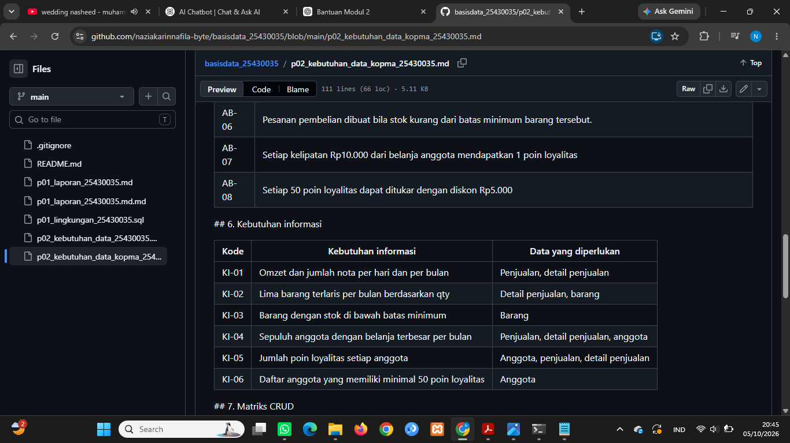

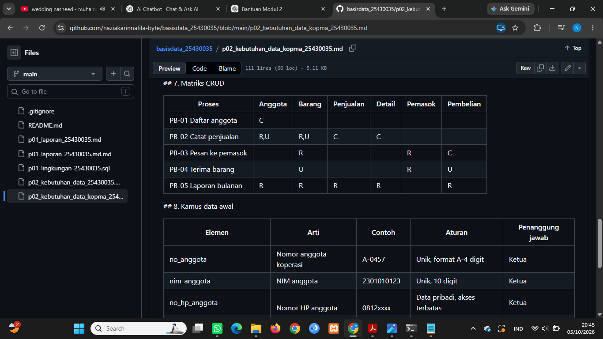

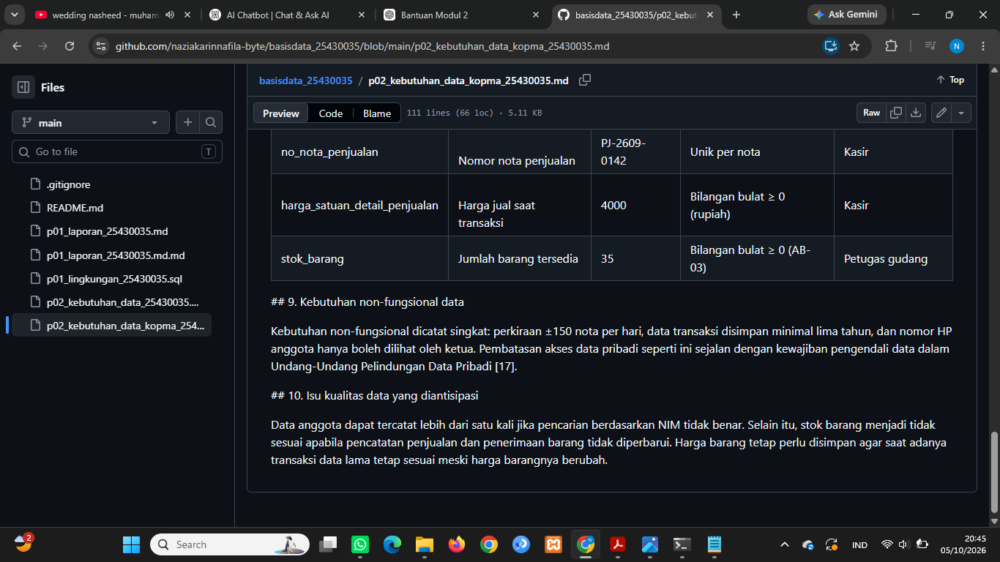

## 4. Jawaban Titik Analisis

Titik Analisis 1

Karena harga itu bukan termasuk data statis atau data yang jarang berubah, tidak tetap. Jika harga diambil dari tabel barang, saat harga barang naik bulan depan, semua harga di nota lama akan ikut naik dan harga asli hilang. Maka ketika harga barang naik diperlukannya nota untuk tetap bisa menyimpan harga saat transaksi tersebut terjadi. Dengan menyimpan harga saat transaksi pada data penjualan, harga yang tercatat di nota lama tetap menunjukkan harga sebenarnya.

Titik Analisis 2

Karena subtotal termasuk nilai turunan yang dapat dihitung kembali dari data kapan saja. Jika tetap disimpan, akibatnya bisa menimbulkan ketidaksesuaian apabila data yang dipakai berubah. Berbeda dengan total yang tetap disimpan apabila organisasi membutuhkan nilai total sebagai bukti jumlah akhir pembayaran saat transaksi dilakukan.

Titik Analisis 3

Tidak adanya huruf C (Create) pada entitas Pemasok berarti tidak ada proses bisnis yang bertugas membuat atau memasukkan data pemasok ke dalam sistem. Perlu ditambahkan proses bisnis untuk mengelola atau menambahkan data pemasok, sehingga entitas Pemasok memiliki proses yang melakukan Create. Untuk memastikan siapa yang mengubah status aktif anggota matriks CRUD perlu diperiksa kembali apakah terdapat proses atau aktor yang bertanggung jawab melakukan perubahan tersebut. Jika tidak ada, maka tanggung jawab ditetapkan dan dicatat sebagai bagian dari proses pengelolaan data anggota.

## 5. Hasil Latihan dan Modifikasi

1. Kopma ingin memberi poin loyalitas: setiap kelipatan Rp10.000 belanja anggota bernilai 1 poin, dan 50 poin dapat ditukar dengan potongan Rp5.000. Tambahkan elemen data, aturan bisnis (AB-07 dan seterusnya), kebutuhan informasi, dan perbarui matriks CRUD.

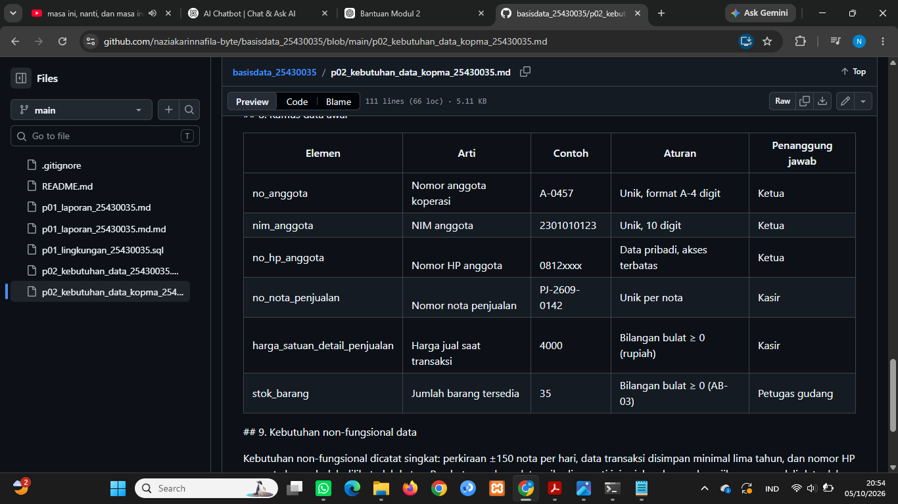

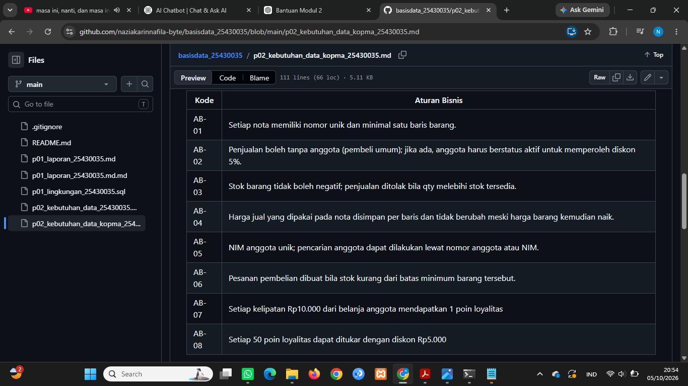

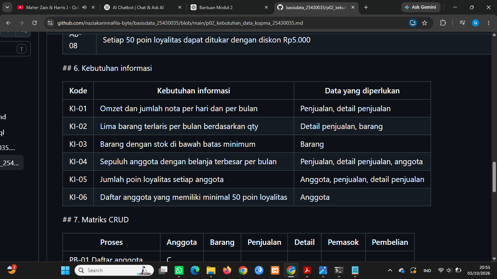

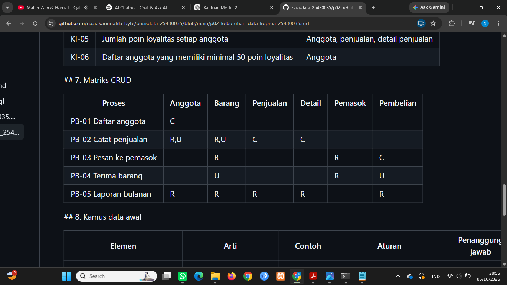

2. Perbaiki tiga pernyataan kebutuhan kabur berikut agar dapat diuji: (a) “data anggota harus aman”; (b) “sistem harus cepat mencari barang”; (c) “laporan stok harus akurat”.

(a) Data nomor HP anggota hanya dapat dilihat oleh pengguna yang memiliki hak akses sebagai ketua koperasi

(b) Pencarian barang berdasarkan kode atau nama barang harus menampilkan hasil pencarian paling lambat 2 detik

(c) Jumlah stok yang ditampilkan pada laporan harus sama dengan jumlah stok yang tercatat pada data barang setelah transaksi penjualan dan penerimaan barang berhasil diproses

## 6. Tugas Mandiri: Milestone Proyek 2

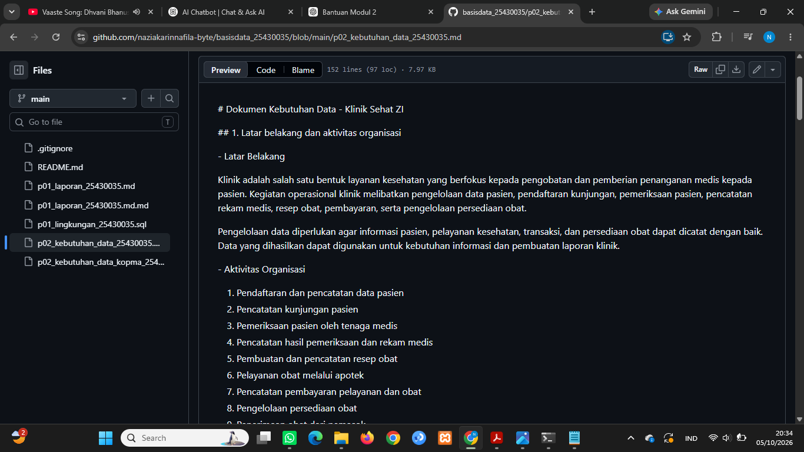

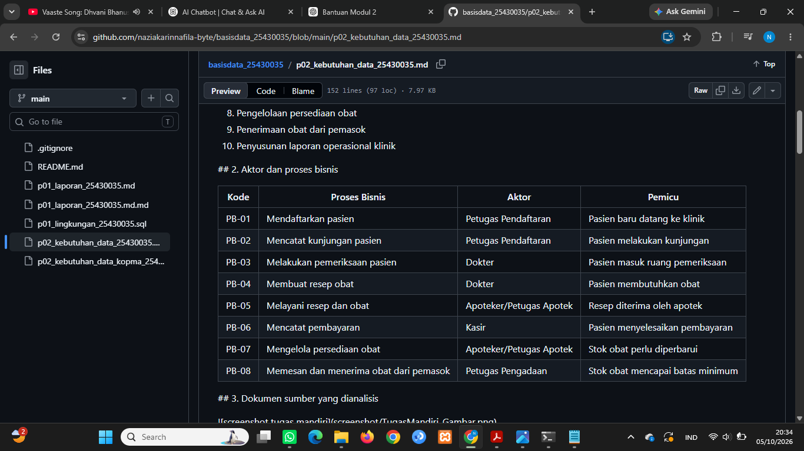

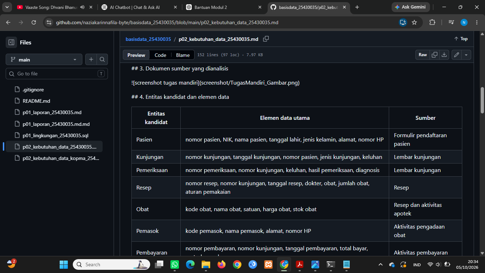

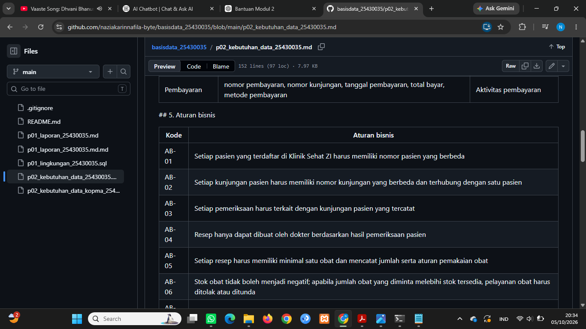

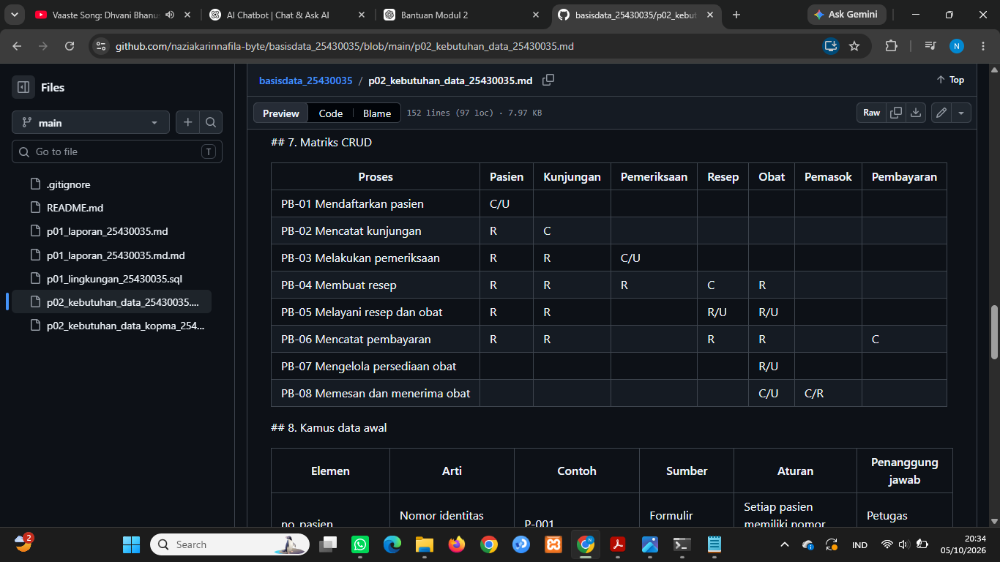

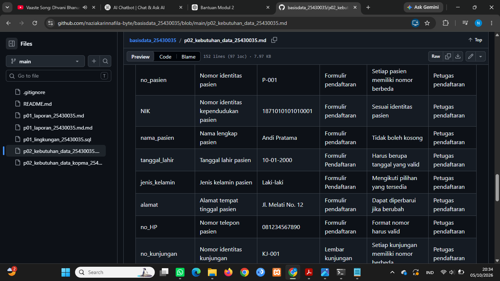

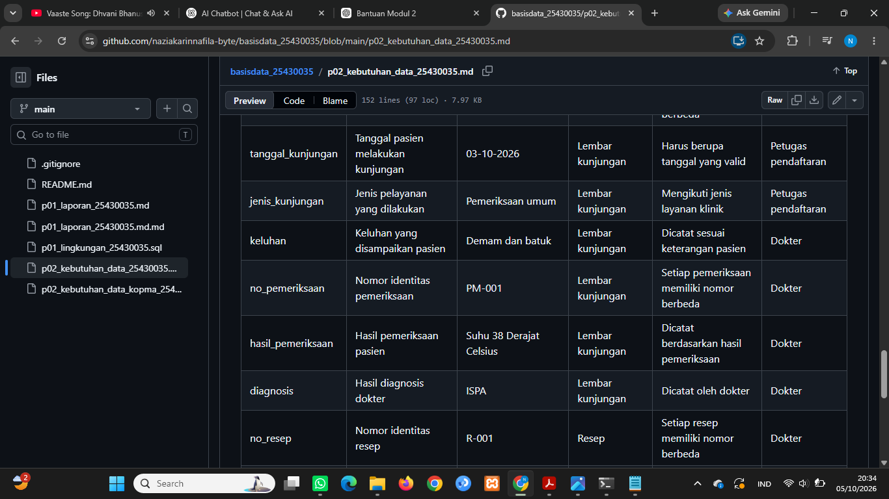

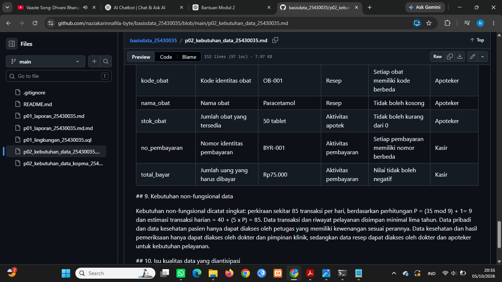

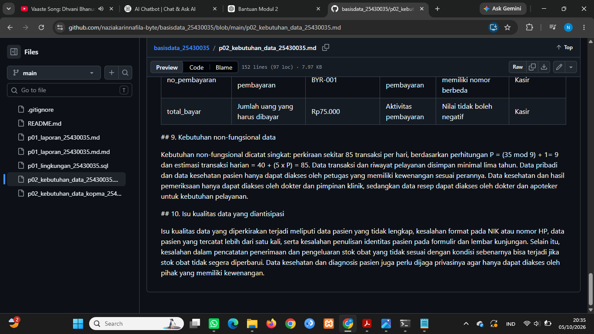

## 7. Pembahasan dan Kendala

Berdasarkan hasil analisis yang dilakukan mengenai kebutuhan data pada Klinik Sehat ZI, pengelolaan data sangat diperlukan guna mendukung kegiatan operasional seperti pendaftaran pasien, kunjungan, pemeriksaan, pembuatan resep, pelayanan obat, pembayaran, dan pengelolaan persediaan obat. Setiap kegiataan memiliki aktor dan proses bisnis yang berbeda sehingga data yang digunakan juga disesuaikan dengan kebutuhan proses.

Kendalanya yaitu diperlukan ketelitian dalam menyusun aturan bisnis(AB-XX) dan matriks CRUD agar setiap proses bisnis berhubungan dengan entitas lalu memperkirakan kebutuhan non-fungsional seperti volume data, lama penyimpanan, dan hak akses data. 

## 8. Kesimpulan

Dari praktikum ini mahasiswa diharapkan dapat mampu melakukan analisis kebutuhan sistem sebelum membuat database. Praktikum ini juga memberikan pemahaman tentang bagaimana cara mengidentifikasi proses bisnis, aktor, dokumen sumber yang dibutuhkan, entitas, aturan, dan matriks CRUD. Mahasiswa mampu berlatih melakukan modifikasi melalui langkah-langkah percobaan di dalam buku praktik. Praktikum ini juga membantu pengelolaan data dapat disusun secara lebih terstruktur sesuai dengan aktivitas organisasi.

## 9. Pernyataan Penggunaan AI

Dalam pembuatan dokumen fiktif klinik serta membantu dalam menjawab pertanyaan titik analisis

## 10. Bukti Git 

Bukti Git - Basis Data 25430035

**Repositori:** [naziakarinnafila-byte/basisdata_25430035](https://github.com/naziakarinnafila-byte/basisdata_25430035)
**Commit Terbaru:** `4b090b2` - docs: tambah laporan p02_laporan_25430035
**Tautan Commit:** [4b090b2 - docs tambah laporan p02](https://github.com/naziakarinnafila-byte/basisdata_25430035/commit/4b090b2)

## Checklist

||Jenis|Yang harus ada|
|-|-|-|
|V|Berkas wajib|p02_kebutuhan_data_kopma_<NIM>.md dan p02_kebutuhan_data_<NIM>.md (proyek)|
|V|Bukti tangkapan layar|Tabel PB, AB, KI, matriks CRUD, dan kamus data di berkas proyek (tangkapan tampilan GitHub)|
|V|Analisis wajib|Titik Analisis 1–3; perhitungan parameter P; perbaikan tiga pernyataan kebutuhan kabur|

